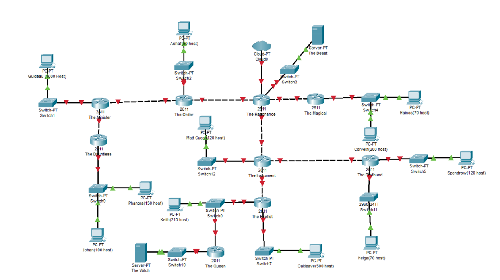
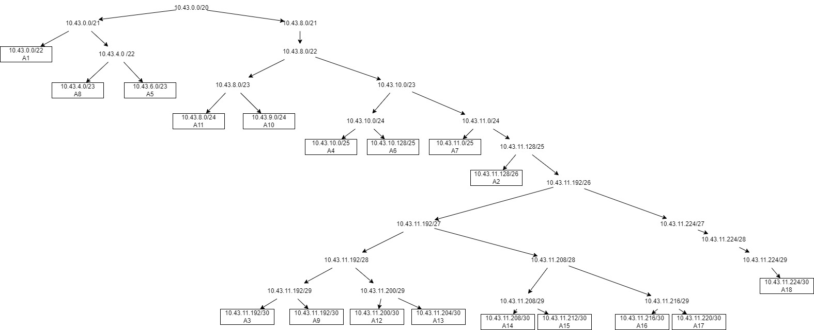

# Jarkom-Modul-4-ITA07-2022

## Laporan Hasil Praktikum Modul 4 Kelompok ITA07

Anggota kelompok: 

| Ariel Daffansyah Aliski | 5027201058 |
| --- | --- |
| Anak Agung Bintang Krisna Dewi | 5027201060 |
| Naftali Salsabila Kanaya Putri | 5027201012 |

**Soal Shift Modul 4 - Subnetting & Routing**

Adapun untuk topologi yang harus dibuat adalah sebagai berikut

## Metode VLSM

Hal pertama yang kami lakukan dalam mengerjakan ini adalah membuat topologinya terlebih dahulu

Berikut adalah hasil topologi yang kami buat

Setelah itu, kami melakukan perhitungan untuk pembagian IPnya sebagai berikut:

| Nama Subnet | Size Diperlukan | Dialokasikan | Netmask | Subnet Mask | Network ID | Assignable IP Range | Broadcast Address |
| --- | --- | --- | --- | --- | --- | --- | --- |
| A3 | 2 | 2 | /30 | 255.255.255.252 | 10.43.0.0 | 10.43.0.1 - 10.43.0.2 | 10.43.0.3 |
| A8 | 2 | 2 | /30 | 255.255.255.252 | 10.43.0.4 | 10.43.0.5 - 0.48.0.6 | 10.43.0.7 |
| A12 | 2 | 2 | /30 | 255.255.255.252 | 10.43.0.8 | 10.43.0.9 - 10.43.0.10 | 10.43.0.11 |
| A13 | 2 | 2 | /30 | 255.255.255.252 | 10.43.0.12 | 10.43.0.13 - 10.43.0.14 | 10.43.0.15 |
| A14 | 2 | 2 | /30 | 255.255.255.252 | 10.43.0.16 | 10.43.0.17 - 10.43.018 | 10.43.0.19 |
| A15 | 2 | 2 | /30 | 255.255.255.252 | 10.43.0.20 | 10.43.0.21 - 10.43.0.22 | 10.43.0.23 |
| A16 | 2 | 2 | /30 | 255.255.255.252 | 10.43.0.24 | 10.43.0.25 - 10.43.0.26 | 10.43.0.27 |
| A17 | 2 | 2 | /30 | 255.255.255.252 | 10.43.0.28 | 10.43.0.29 - 10.43.0.30 | 10.43.0.31 |
| A18 | 2 | 2 | /30 | 255.255.255.252 | 10.43.0.32 | 10.43.0.33 - 10.43.0.34 | 10.43.0.35 |
| A2 | 51 | 62 | /26 | 255.255.255.192 | 10.43.0.64 | 10.43.0.65 - 10.43.0.126 | 10.43.0.127 |
| A4 | 121 | 126 | /25 | 255.255.255.128 | 10.43.0.128 | 10.43.0.129 - 10.43.0.254 | 10.43.0.255 |
| A6 | 121 | 126 | /25 | 255.255.255.128 | 10.43.1.0 | 10.43.1.1 - 10.43.1.126 | 10.43.1.127 |
| A11 | 71 | 126 | /25 | 255.255.255.128 | 10.43.1.128 | 10.43.1.129 - 10.43.1.254 | 10.43.1.255 |
| A7 | 251 | 254 | /24 | 255.255.255.0 | 10.43.2.0 | 10.43.2.1 - 10.43.2.254 | 10.43.2.255 |
| A9 | 212 | 254 | /24 | 255.255.255.0 | 10.43.3.0 | 10.43.3.1 - 10.43.3.245 | 10.43.3.255 |
| A10 | 501 | 510 | /23 | 255.255.254.0 | 10.43.4.0 | 10.43.4.1 - 10.43.5.254 | 10.43.5.255 |
| A5 | 271 | 510 | /23 | 255.255.254.0 | 10.43.6.0 | 10.43.6.1 - 10.43.7.254 | 10.43.7.255 |
| A1 | 1001 | 1022 | /22 | 255.255.252.0 | 10.43.8.0 | 10.43.8.1 - 10.43.11.254 | 10.43.11.255 |
| Total | 2618 |  | /20 |  |  |  |  |

Lalu kita membuat tree sebagai berikut

Setelah semua selesai, kita perlu melakukan konfigurasi pada packet tracer sebagai berikut:

## Metode CIDR & Kendala

Untuk kendala ada di metode CIDR karena belum dapat kami selesaikan
